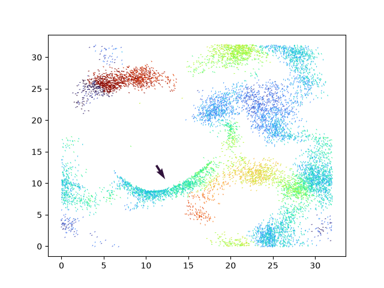
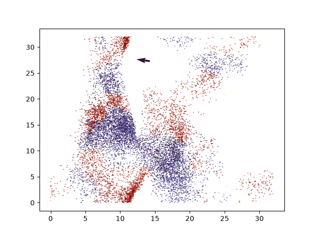

<h1 align="center"> The Swarm </h1>

A Python simulation of a bird swarm behaviour and predator-prey interactions. The simulation models how birds adjust their movement based on nearby birds and react to the presence of a predator. The predator follows the direction of the nearest bird.

## Instructions

Install the required dependencies:

```bash
pip install numpy scipy matplotlib
```
Run the simulation:
```bash
python simulation.py
```

## Example images

<p align="center">
  
  
</p>

